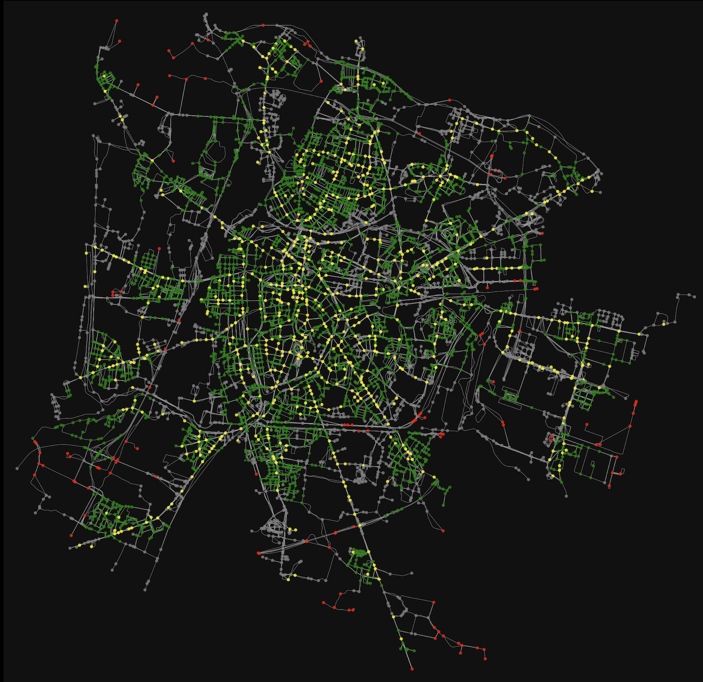

<br/>
<p align="center">
  <h3 align="center">Padua15</h3>

  <p align="center">
    A Network Approach for 15-Minute City Expansion
    <br/>
    <br/>
  </p>
</p>

 

## Table Of Contents

* [About the Project](#about-the-project)
* [Built With](#built-with)
* [Getting Started](#getting-started)
  * [Prerequisites](#prerequisites)
* [Usage](#usage)
* [Results](#results)
* [Authors](#authors)
* [Acknowledgements](#acknowledgements)

## About The Project



This study explores practical solutions for urban challenges arising from long journeys and uncontrolled city growth. Inspired by the 15 Minute City idea, we focus on making essential services accessible within a 15-minute walk (or bike ride) in Padua. Using a network-based approach, we analyze the current state of the city and propose ways to expand the coverage of services within this timeframe. Our goal is to create a more convenient and sustainable urban living experience, addressing issues like traffic, air quality and time waste.

## Built With

Here are the major libraries used to develop the project:

* [OSMnx](https://osmnx.readthedocs.io/en/stable/)
* [NetworkX](https://networkx.org/)
* [GeoPandas](https://geopandas.org/en/stable/index.html)

## Getting Started

This is an example of how you may give instructions on setting up your project locally.
To get a local copy up and running follow these simple example steps.

### Prerequisites

The requirements.txt file lists all Python libraries that the notebooks depend on, install them using:

```sh
pip install -r requirements.txt
```

> [!WARNING]
> The code has been tested ONLY with the versions specified by the requirments.txt, different versions may not work

### Installation

1. Clone the repo

```sh
git clone https://github.com/danielcharles0/LFN2324.git
```

2. Install the prerequisities

```sh
pip install -r requirements.txt
```

3. Follow the instructions on the [usage section](#usage)

## Usage

1. (optional) Run the 01_SetupNearestNode notebook to setup the data for the analysis
2. Run the 02_Coverage notebook to get the initial coverage of the city
3. Run the 03_Communities notebook to identify the positions of the new POIs
4. Run the 04a_CoverageCloseness and 04b_CoverageBetweenness to repeat the analysis and get the final results

> [!NOTE]  
> Coverage notebooks may take approximately 5 minutes to complete

## Results
The initial coverage of all categories is 35%. The coverage after applying the code is the following: 

* With Betweenness centrality, **increases to approximately 67%**
* With Closeness centrality, **increases to approximately 64%**

Full results can be seen in the project report.

> [!NOTE]  
> Results may vary slightly due to the random shuffle in the Louvain algorithm, consult the [NetworkX documentation](https://networkx.org/documentation/stable/reference/algorithms/generated/networkx.algorithms.community.louvain.louvain_communities.html#networkx.algorithms.community.louvain.louvain_communities) for more informations

## Authors

* **Bolzonello Enrico** - *MSc Computer Engineering Student @ UniPD* - [Bolzonello Enrico](https://github.com/enricobolzonello/)
* **Carlesso Daniel** - *MSc Computer Engineering Student @ UniPD* - [Carlesso Daniel](https://github.com/danielcharles0)
* **Zadro Michele** - *MSc Computer Engineering Student @ UniPD* - [Zadro Michele](https://github.com/MicheleZadro)

## Acknowledgements
Many thanks to the professor Fabio Vandin, professor of Learning from Networks course in the academic year 2023/24.
